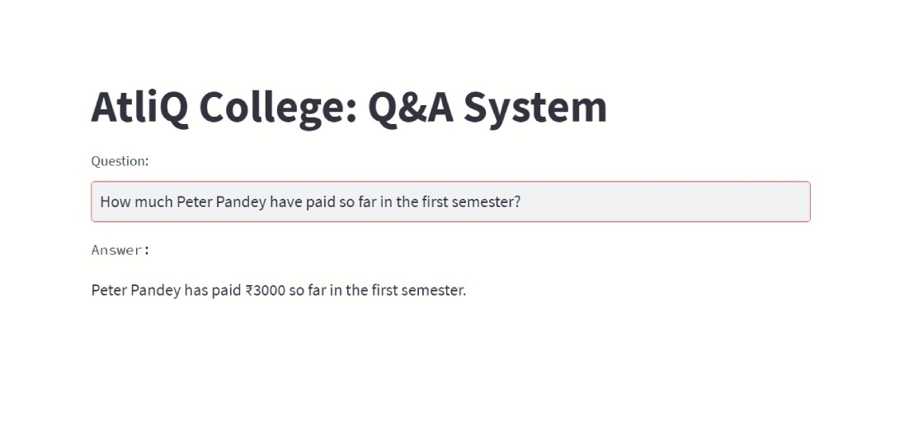

# OpenAI Function Calling Tutorial For Beginners
### College management Q&A system using openai function calls 



Build a system that can take input question related to a database of an imaginary college called AtliQ Commerce College. Here are some sample questions you can ask to this Q&A system.


### Sample questions

1. How much peter pandey have to pay in the first semester?
   1. This should return "pending" fees 
1. How much did peter pandey paid in the first semester?
   1. This should return "paid" fees
1. What is the purpose of a balance sheet?.
   1. This is not a question related to college's internal data. It is rather a general question that openai LLM can answer using its past training (similar to ChatGPT)
1. Average gpa in third semester?
   1. This will return an average GPA of all the students in the third semester

## Tech Stack

```commandline
Database: MySQL
Backend: Python + OpenAI Function Calling
Frontend: Streamlit
```

## Installation

### - Database

### - Python
#### 1. Clone the repository
```bash
https://github.com/sumitdas1984/financial_data_extraction_tool.git
```

#### 2. Create a Python environment
Python 3.8 or higher using `pyenv`. 

``` bash
cd atliqcollege_qa_tool
python3 -m venv .venv
source .venv/bin/activate
```

#### 3. Install the required dependencies
```bash
pip install -r requirements.txt
```

#### 4. Set up the keys in a .env file
First, create a `.env` file in the root directory of the project. Inside the file, add your OpenAI and Groq API key.

## Running streamlit app
From your command line run this command,
```bash
streamlit run app.py
```
